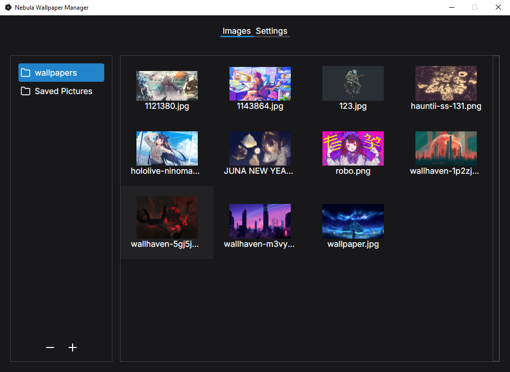
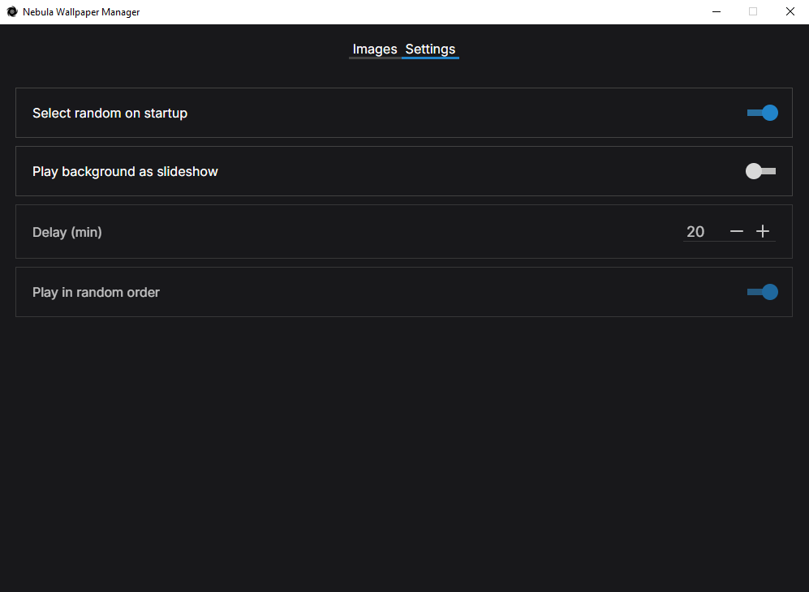

# Nebula Wallpaper Manager

## Table of contents
- [Overview](#overview)
  - [Features](#features)
  - [Screenshot](#screenshot)
  - [Links](#links)
- [My process](#my-process)
  - [Built with](#built-with)
- [Installation](#installation)
  - [Prerequisites](#prerequisites)
  - [Steps](#steps)
- [Attribution](#attribution)
- [Author](#author)

## Overview
NWM is a desktop wallpaper manager that allows you to control your desktop experience with an easy and beautiful interface.

### Features
- Select Image: Choose a specific image to set as your wallpaper.
- Random Image Selection: Automatically select a random image as your wallpaper on app startup.
- Save Folder Paths: Save the paths of folders containing your images.
- Change Folders: Easily switch between different folders of images.
- Create Slideshow: Create a slideshow with images from the current folder.

### Screenshots



## My Process
### Built with
- [React](https://reactjs.org/)
- [Typescript](https://www.typescriptlang.org/)
- [Rust](https://www.rust-lang.org/)
- [Tauri](https://tauri.app/)

## Installation
### Prerequisites
- Node.js
- Rust
- Tauri

### Steps
1. Clone the repository
```bash
git clone https://github.com/yan-batista/nebula_wallpaper_manager
cd nebula_wallpaper_manager
```
2. Install dependecies
```bash
npm install
```
3. Build the tauri application
```bash
npm run tauri build
```
4. Run the application
```bash
npm run tauri dev
```

## Attribution
- [Icon: Buraco negro ícones criados por Vector Stall - Flaticon](https://www.flaticon.com/br/icones-gratis/buraco-negro)


## Author
- Github - [@yan-batista](https://github.com/yan-batista)
- Email - bsouza.yan@gmail.com